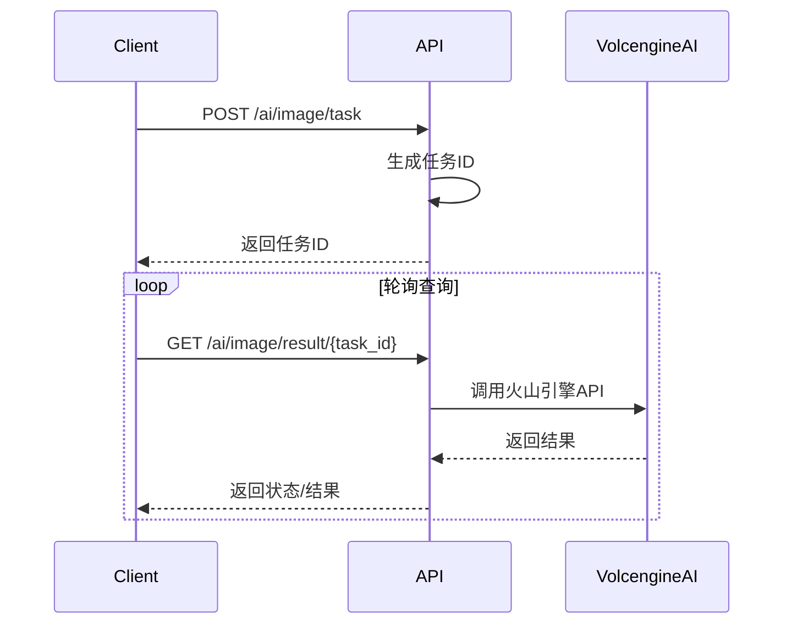

# 火山引擎即梦AI异步接口文档

## 概述

火山引擎即梦AI服务提供高质量的文本到图像生成功能。本文档描述了**纯异步模式**的API接口，所有图像生成都通过任务ID进行管理，确保用户出图的稳定性。

## 基础信息

- **基础URL**: `http://localhost:8080/api/v1`
- **认证方式**: 无需认证（开发环境）
- **内容类型**: `application/json`
- **响应格式**: JSON

## 异步工作流程

1. **创建任务**: 调用创建接口，获得任务ID
2. **轮询查询**: 使用任务ID定期查询结果
3. **获取结果**: 任务完成后获得图像URL



## API接口

### 1. 创建图像生成任务

创建一个异步图像生成任务。

**请求**
```http
POST /api/v1/ai/image/task
Content-Type: application/json

{
    "prompt": "一只可爱的橘猫在樱花树下玩耍，动漫风格，高质量",
    "model": "doubao-seedream-3.0-t2i",
    "size": "1024x1024",
    "quality": "standard",
    "style": "anime",
    "user_id": "user_123",
    "n": 1,
    "options": {
        "custom_param": "value"
    }
}
```

**请求参数**

| 参数 | 类型 | 必需 | 描述 | 默认值 |
|------|------|------|------|--------|
| `prompt` | string | ✅ | 图像描述文本 | - |
| `user_id` | string | ✅ | 用户ID | - |
| `model` | string | ❌ | 模型名称 | `doubao-seedream-3.0-t2i` |
| `size` | string | ❌ | 图像尺寸 | `1024x1024` |
| `quality` | string | ❌ | 图像质量 | `standard` |
| `style` | string | ❌ | 图像风格 | - |
| `n` | integer | ❌ | 生成图像数量 | `1` |
| `options` | object | ❌ | 自定义选项 | `{}` |

**支持的参数值**

- **size**: `256x256`, `512x512`, `1024x1024`, `1024x1792`, `1792x1024`
- **quality**: `standard`, `hd`
- **style**: `natural`, `anime`, `cyberpunk`, `realistic`

**成功响应 (201 Created)**
```json
{
    "success": true,
    "data": {
        "task_id": "volcengine_img_1703123456789",
        "status": "pending",
        "message": "任务已创建，正在处理中",
        "provider": "volcengine_jimeng",
        "system_task_id": "64a1b2c3d4e5f6789"
    },
    "message": "图像生成任务创建成功"
}
```

**错误响应 (400 Bad Request)**
```json
{
    "error": "请求参数错误",
    "message": "Key: 'VolcengineImageRequest.Prompt' Error:Field validation for 'Prompt' failed on the 'required' tag"
}
```

### 2. 查询任务结果

通过任务ID查询图像生成结果。

**请求**
```http
GET /api/v1/ai/image/result/{task_id}
```

**路径参数**

| 参数 | 类型 | 必需 | 描述 |
|------|------|------|------|
| `task_id` | string | ✅ | 任务ID |

**处理中响应 (202 Accepted)**
```json
{
    "success": true,
    "data": {
        "task_id": "volcengine_img_1703123456789",
        "status": "processing",
        "message": "任务处理中，请稍后查询"
    }
}
```

**完成响应 (200 OK)**
```json
{
    "success": true,
    "data": {
        "task_id": "volcengine_img_1703123456789",
        "status": "completed",
        "result": {
            "id": "volcengine_img_1703123456789",
            "type": "image",
            "image_url": "https://example.com/generated-image.jpg",
            "provider": "volcengine_jimeng",
            "duration": 5000000000,
            "cost": 0.02,
            "metadata": {
                "task_id": "volcengine_img_1703123456789",
                "model": "doubao-seedream-3.0-t2i",
                "prompt": "一只可爱的橘猫在樱花树下玩耍，动漫风格，高质量",
                "size": "1024x1024",
                "quality": "standard",
                "created": 1703123456,
                "data": [
                    {
                        "url": "https://example.com/generated-image.jpg",
                        "revised_prompt": "A cute orange cat playing under cherry blossom trees, anime style, high quality"
                    }
                ]
            }
        },
        "image_url": "https://example.com/generated-image.jpg"
    },
    "message": "任务完成"
}
```

**失败响应 (500 Internal Server Error)**
```json
{
    "error": "任务执行失败",
    "message": "火山引擎API错误: Invalid prompt",
    "data": {
        "task_id": "volcengine_img_1703123456789",
        "status": "failed"
    }
}
```

**任务不存在 (400 Bad Request)**
```json
{
    "error": "任务ID不能为空"
}
```

## 任务状态说明

| 状态 | 描述 | HTTP状态码 |
|------|------|------------|
| `pending` | 任务已创建，等待处理 | 201 |
| `processing` | 任务处理中 | 202 |
| `completed` | 任务完成 | 200 |
| `failed` | 任务失败 | 500 |

## 使用示例

### 基础用法

```bash
# 1. 创建任务
curl -X POST "http://localhost:8080/api/v1/ai/image/task" \
  -H "Content-Type: application/json" \
  -d '{
    "prompt": "一只可爱的小猫咪在花园里玩耍",
    "user_id": "user_123"
  }'

# 响应: {"success":true,"data":{"task_id":"volcengine_img_1703123456789",...}}

# 2. 查询结果
curl -X GET "http://localhost:8080/api/v1/ai/image/result/volcengine_img_1703123456789"
```

### 高级用法

```bash
# 创建高质量动漫风格图像
curl -X POST "http://localhost:8080/api/v1/ai/image/task" \
  -H "Content-Type: application/json" \
  -d '{
    "prompt": "未来科技城市夜景，霓虹灯闪烁，赛博朋克风格",
    "model": "doubao-seedream-3.0-t2i",
    "size": "1024x1024",
    "quality": "hd",
    "style": "cyberpunk",
    "user_id": "user_123",
    "n": 1
  }'
```

### JavaScript示例

```javascript
// 创建任务
async function createImageTask(prompt, userId) {
    const response = await fetch('/api/v1/ai/image/task', {
        method: 'POST',
        headers: {
            'Content-Type': 'application/json',
        },
        body: JSON.stringify({
            prompt: prompt,
            user_id: userId,
            model: 'doubao-seedream-3.0-t2i',
            size: '1024x1024',
            quality: 'standard'
        })
    });
    
    const result = await response.json();
    return result.data.task_id;
}

// 轮询查询结果
async function pollTaskResult(taskId, maxAttempts = 30) {
    for (let i = 0; i < maxAttempts; i++) {
        const response = await fetch(`/api/v1/ai/image/result/${taskId}`);
        const result = await response.json();
        
        if (result.data.status === 'completed') {
            return result.data.result.image_url;
        } else if (result.data.status === 'failed') {
            throw new Error('任务失败');
        }
        
        // 等待3秒后重试
        await new Promise(resolve => setTimeout(resolve, 3000));
    }
    
    throw new Error('任务超时');
}

// 使用示例
async function generateImage() {
    try {
        const taskId = await createImageTask('一只可爱的小猫', 'user_123');
        console.log('任务创建成功:', taskId);
        
        const imageUrl = await pollTaskResult(taskId);
        console.log('图像生成完成:', imageUrl);
    } catch (error) {
        console.error('生成失败:', error);
    }
}
```

## 错误处理

### 常见错误码

| 错误码 | 描述 | 解决方案 |
|--------|------|----------|
| 400 | 请求参数错误 | 检查必需参数是否提供 |
| 500 | 服务器内部错误 | 检查服务状态，重试请求 |
| 404 | 接口不存在 | 检查URL路径是否正确 |

### 重试策略

建议实现指数退避重试策略：

```javascript
async function retryWithBackoff(fn, maxRetries = 3) {
    for (let i = 0; i < maxRetries; i++) {
        try {
            return await fn();
        } catch (error) {
            if (i === maxRetries - 1) throw error;
            
            const delay = Math.pow(2, i) * 1000; // 1s, 2s, 4s
            await new Promise(resolve => setTimeout(resolve, delay));
        }
    }
}
```

## 性能优化

### 最佳实践

1. **合理的轮询间隔**: 建议3-5秒查询一次
2. **设置超时时间**: 避免无限等待
3. **错误处理**: 实现重试机制
4. **缓存结果**: 避免重复查询已完成的任务

### 限制说明

- 单次请求最大图像数量: 4张
- 任务超时时间: 5分钟
- 并发任务限制: 每用户最多10个并发任务

## 测试工具

项目提供了完整的测试脚本：

```bash
# 运行异步API测试
./test_volcengine_async_api.sh
```

测试脚本包含：
- 健康检查
- 用户创建
- 任务创建
- 结果查询
- 参数校验
- 错误处理

## 更新日志

### v2.0.0 (当前版本)
- 🔄 **重大变更**: 改为纯异步模式
- ✅ 新增任务ID管理机制
- ✅ 优化用户出图稳定性
- ✅ 完善错误处理和状态管理
- ❌ 移除同步图像生成接口

### v1.0.0
- ✅ 基础同步图像生成功能
- ✅ 火山引擎API集成 